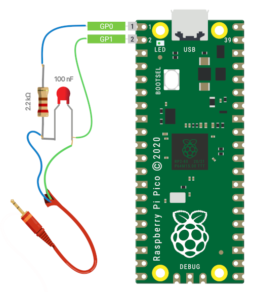

# :speech_balloon:  Talkberry - A Speech Codec Library for RP2040

This project provides a speech codec library for the RP2040 microcontroller chip using the open-source [Codec2 algorithm](https://en.wikipedia.org/wiki/Codec_2). It enables storing long segments of speech in the limited memory of an embedded system or transferring digital voice across narrow band channels such as HAM radio.

The [RP2040 microcontroller chip](https://en.wikipedia.org/wiki/RP2040) is a powerful and affordable option for embedded systems, based on the [ARM Cortex-M0+](https://en.wikipedia.org/wiki/ARM_Cortex-M#Cortex-M0+) architecture. However, it has no floating-point instructions which makes the existing implementation run considerably slower than realtime (3.5x), despite it being well-written.

This port is trying to speed up the execution on limited platforms like this by implementing the math with fixed-point arithmetic. Having a super-cheap, readily available IC opens up various possibilities for shortwave HAM radio, voice-over-IP (VoIP) systems, and voice storage. Imagine a [FreeDV](https://freedv.org/) implementation on a 4$ board the size of a postage stamp that could be retrofitted to any radio!

## Features

- **Lightweight** implementation of the Codec2 algorithm **optimized** for the RP2040 microcontroller chip
- Efficient speech ~~compression~~ and decompression suitable for embedded systems and narrow-band communication channels
- Supports 1300bps mode, **24 hours of speech fits into ~13.4 Megabytes**
- Uses DMA and PWM to generate **audio directly from PICO** - no I2S needed, just a simple RC filter
- Uses **~25% total CPU**, plenty of room for other code

## Audio Sample (... not hearing anything? unmute the player)

https://user-images.githubusercontent.com/7192749/222575368-ad214381-2826-42ff-9a80-032405458778.mp4

## Getting Started



To use the speech codec library in your project, simply include the header file and link to the library file. The library interface is super simple and provides essential functions for encoding and decoding speech (well, just decoding for now). Here is the tl;dr version of how to use the library:

- Include codec2 header in your program and link against the codec2 library.
- Call codec2_init() at the start of your program once with no arguments
- Call codec2_decode(output, input) on a packet provided as *input*, get decoded raw signed audio back in *output*.

To quickly test it:
  1. Wire the audio like suggested on the diagram
  2. Download pico-hamradio.uf2 from the demos folder
  3. Power on the pico while holding the BOOTSEL button
  4. Pico will act like an USB drive
  5. Copy the file to it

It is a good idea to add a small resistor (22 or 47 Ω) to GP1 which is used as channel B PWM output. Permanently fixed at mid-point of the output voltage range, it uses inverted PWM polarity. These two hacks help reduce the noise level and produce a better (slightly less annoying) audio.

---

## Building

### ... for PICO
```
mkdir build
cd build
PICO_SDK_PATH=/your/sdk/path cmake ..
make
```

### ... for RPI

```
mkdir build
cd build
cmake ..
make
```

Currently, data is a simple byte array in the header file *data.h*, read in 7-byte chunks. This wastes 4 bits since packets are 52 bits long. The solution would be to combine two packets in 13 bytes (initial support is provided in the unpack function).

## Converting the audio to a suitable format

If you want to replace the provided audio with your own, it will need to be encoded with codec2.

Many Linux distros have Codec2 packaged, so you can easily install it (_apt install codec2_ on Debian-based distros) and then use c2enc to encode speech. Here is an example how you might approach encoding:

```
1. sox infile.wav -e signed -b 16 -c 1 - r 8000 raw_voice_data.raw
2. c2enc 1300 raw_voice_data.raw coded_data.bin
3. xxd -i coded_data.bin > /project/rootdir/header/data.h
```

This requires sox, codec2 and xxd to be available.

## Notes On Performance Optimisation

Encoding time for 1 second of audio on 1 core running at 125 MHz clock
```
Floating point ▏   3.542 ██████████████████████████████████████████████████████████
Fixed point    ▏   0.473 ████████                         
```

### LUTs in flash are a performance penalty

Initially, the build uses ~4% memory and 18% flash. 

```
Memory region         Used Size  Region Size  %age Used
           FLASH:      380284 B         2 MB     18.13%
             RAM:       11396 B       256 KB      4.35%
       SCRATCH_X:          0 GB         4 KB      0.00%
       SCRATCH_Y:          0 GB         4 KB      0.00%
```

If you move FFT LUTs to RAM (not declaring them constant should do it), you lose ~30% of RAM but gain ~9% speed and 12% flash. 

```
Memory region         Used Size  Region Size  %age Used
           FLASH:      128684 B         2 MB      6.14%
             RAM:       88676 B       256 KB     33.83%
       SCRATCH_X:          0 GB         4 KB      0.00%
       SCRATCH_Y:          0 GB         4 KB      0.00%
```

### Avoiding expensive operations

- The phase synth function was initially designed to run a loop L times in order to generate the necessary excitation samples. This required repeated use of trigonometric functions. However, replacing this approach with the [Chebyshev method](https://en.wikipedia.org/wiki/Chebyshev_polynomials), which utilizes a recurrence relation turned out to be quite performant. This new approach involves only simple operations such as multiplication, shifting, and subtraction, which are not computationally expensive on the Cortex M0 processor.

$$ sin(n \cdot x) = 2 \cdot sin[(n-1) \cdot x] \cdot cos(x) - sin[(n-2)\cdot x] $$

$$ cos(n \cdot x) = 2 \cdot cos[(n-1) \cdot x] \cdot cos(x) - cos[(n-2)\cdot x] $$

- Magnitude of a complex number can be estimated with a largest error of 1.22% using the extended [α max + β min algorithm](https://en.wikipedia.org/wiki/Alpha_max_plus_beta_min_algorithm) for greater precision.

$$ z=max(z_{0}, z_{1})\, $$

$$ z_{0}=\alpha_{0} \cdot max(|re|, |im|) + \beta_{0} \cdot min(|re|, |im|) $$

$$ z_{1}=\alpha_{1} \cdot max(|re|, |im|) + \beta_{1} \cdot min(|re|, |im|) $$

where α₀=1, β₀=5/32, α₁=27/32, β₁=71/128 and the error does not exceed 1.22%

- Instead of calculating the geometric mean using square roots for energy interpolation, we use a simple linear interpolation. Although this approach does not represent a mathematically accurate problem solution, it provides a fast and acceptable approximation.

- Instead of calculating the phase angle using atan2, and then obtaining real and imaginary components in the frequency domain FFT by computing cos(phi) and sin(phi), we use an alternative method. Relying on the expressions

$$ cos(\phi) = \frac{x}{\sqrt{x^{2}+y^{2}}}, \quad sin(\phi) = \frac{y}{\sqrt{x^{2}+y^{2}}}  $$ 

  we estimate the magnitude using alpha-max, beta-min algorithm to avoid the computationally expensive denominator. This approach only requires a division, which the RP2040 hardware division coprocessor can handle without any issues. By using this method, we can avoid using square roots and limit the number of calls to trigonometric functions. In fact, we only need a single sin/cos for the initial recursion step and 10 calls to cos to convert line spectral frequencies to line spectral pairs. To implement trigonometry using only additions and shifts, we use the CORDIC algorithm.

## FAQ

**Q: Where do I connect GND ?**

A: You don't, it's just GP0 and GP1.

**Q: This sounds terrible**

A: Well, definitely not Hi-Fi ¯\\\_(ツ)\_/¯ - it's compressed to the point where you only send a few lookup table indexes that describe a speech frame to rebuild that segment from scratch.

**Q: With Cortex-M4 and Risc-V available, why bother?**

A: It's very cheap, efficient, available to order (a big factor nowadays) and extremely popular. Also I wanted to learn DSP a bit. :-)

**Q: Can this work on RPi?**

A: Yes, I tried it on RPi 4 and it runs just fine. However, having a FPU and things like NEON SIMD instruction set makes floating point a better choice. If you're building for the RPi and expect performance, consider linking against the full CMSIS library which has different FFT implementation for CPUs with more advanced instruction sets.

## Issues

There are 🪲, dynamics are not quite right (frequency domain bin power calculation needs tweaking), postfilter is greatly simplified to avoid additional FFT.
It would be convenient not having to perform that FFT but do the transform on the frequency domain directly or operate on the time domain. My limited n00b DSP skills are not there yet.

## TODO

- Finish the encoder.
- Figure out how to further improve FFT by moving to assembly and using the RP2040 interpolator peripheral.
- Investigate the option of using lower precision FFT (q15).
- Division takes 9 cycless on the coprocessor, so interleaving the divisions with other operations and using async division routines might speed things up. 

## License

This library is free software. You can redistribute it and/or modify it under the terms of the GNU Lesser General Public License as published by the Free Software Foundation - either version 2.1 of the License, or (at your option) any later version. See the file LICENSE included with this distribution for more information.

## Credits

Codec2 was skillfully architected and designed by [mr. David Rowe](https://www.rowetel.com/codec2.html "Codec2 Homepage").
